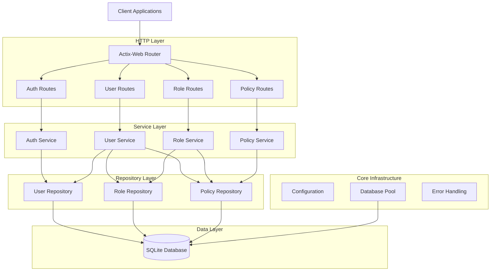
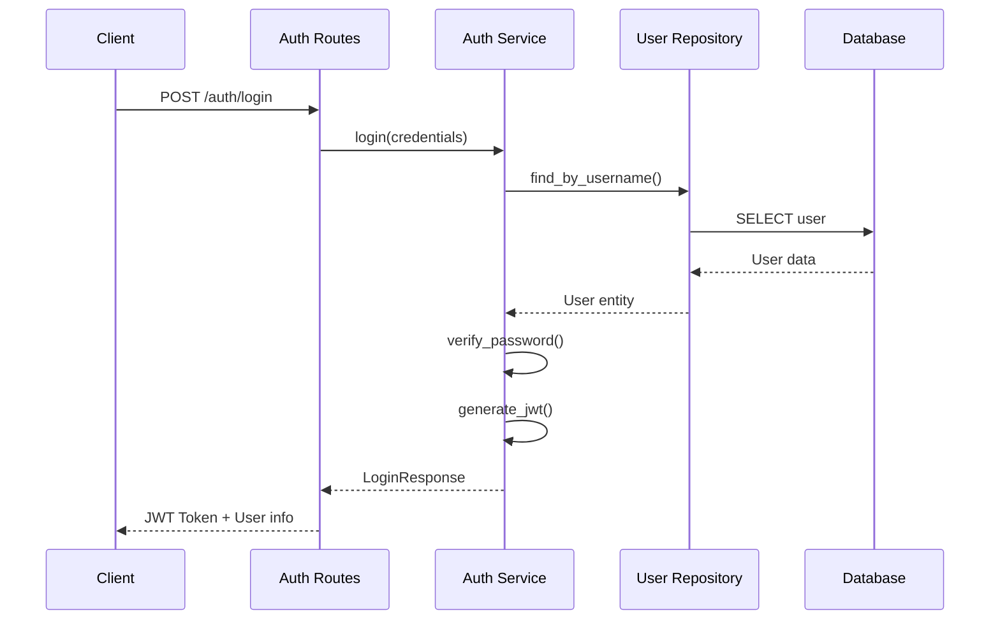
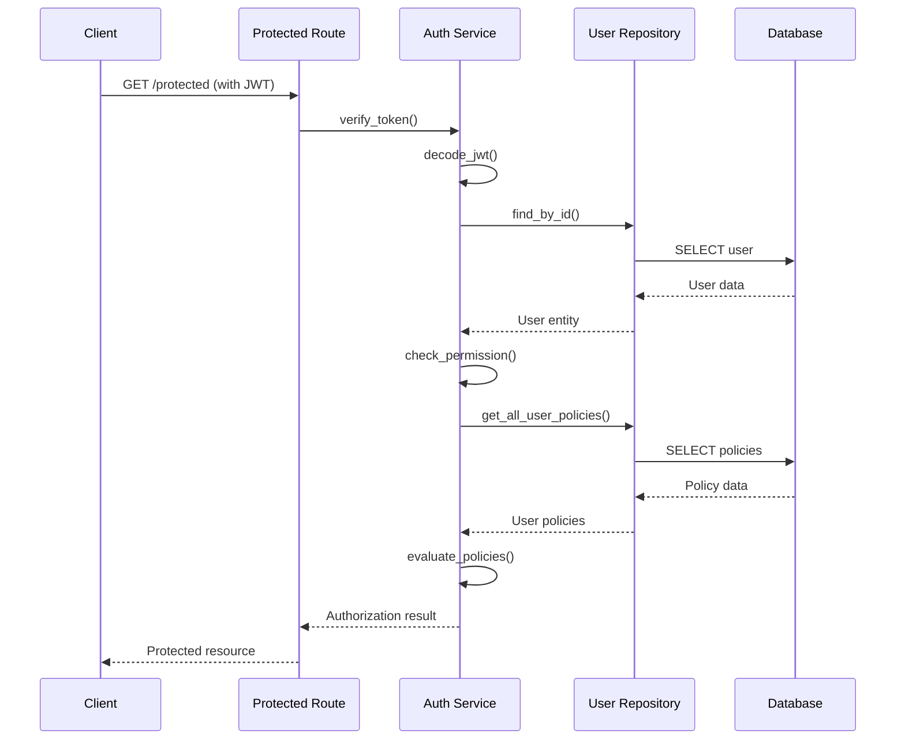
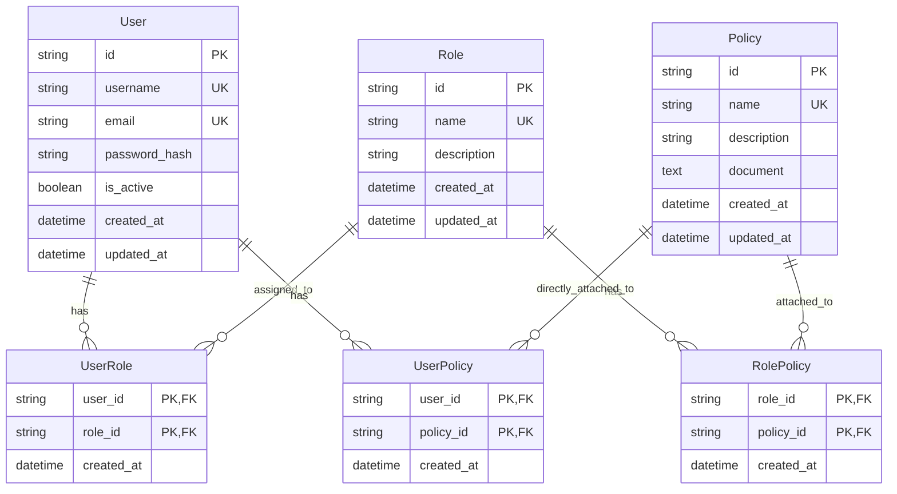

# WHOAMI - Architecture Documentation

## System Overview

WHOAMI is a simplified IAM (Identity and Access Management) service inspired by AWS IAM. It provides authentication and authorization capabilities through a REST API built with modern Rust technologies.

## Architectural Principles

### Clean Architecture
The application follows clean architecture principles with clear separation of concerns:

```
┌─────────────────────────────────────────────┐
│                   Routes                    │  ← HTTP handlers
├─────────────────────────────────────────────┤
│                  Services                   │  ← Business logic
├─────────────────────────────────────────────┤
│                Repository                   │  ← Data access
├─────────────────────────────────────────────┤
│                  Models                     │  ← Domain entities
├─────────────────────────────────────────────┤
│                   Core                      │  ← Infrastructure
└─────────────────────────────────────────────┘
```

### Layer Responsibilities

#### 1. Routes Layer (HTTP Interface)
- **Location**: `src/routes/`
- **Purpose**: HTTP request handling and response formatting
- **Responsibilities**:
  - Parse HTTP requests
  - Validate input parameters
  - Call appropriate services
  - Format responses
  - Handle HTTP-specific errors
- **Dependencies**: Services layer only

#### 2. Services Layer (Business Logic)
- **Location**: `src/services/`
- **Purpose**: Core business logic and orchestration
- **Responsibilities**:
  - Implement business rules
  - Coordinate between repositories
  - Handle authentication and authorization
  - Policy evaluation
  - Data transformation
- **Dependencies**: Repository and Core layers

#### 3. Repository Layer (Data Access)
- **Location**: `src/repository/`
- **Purpose**: Database operations and data persistence
- **Responsibilities**:
  - CRUD operations
  - Query execution
  - Transaction management
  - Data mapping
- **Dependencies**: Models and Core layers only

#### 4. Models Layer (Domain Entities)
- **Location**: `src/models/`
- **Purpose**: Domain model definitions
- **Responsibilities**:
  - Define data structures
  - Implement business entity logic
  - Serialization/deserialization
- **Dependencies**: None (pure domain logic)

#### 5. Core Layer (Infrastructure)
- **Location**: `src/core/`
- **Purpose**: Cross-cutting concerns and infrastructure
- **Responsibilities**:
  - Configuration management
  - Database connection
  - Error handling
  - Logging setup
- **Dependencies**: External libraries only

## Component Diagram



## Data Flow Architecture

### Authentication Flow



### Authorization Flow



## Security Architecture

### Authentication Mechanism
- **JWT Tokens**: Stateless authentication using JSON Web Tokens
- **Password Hashing**: bcrypt with configurable cost factor
- **Token Expiration**: Configurable token lifetime (default: 24 hours)

### Authorization Model
The system implements a policy-based access control (PBAC) model similar to AWS IAM:

1. **Users**: Identity entities that can authenticate
2. **Roles**: Collections of permissions that can be assigned to users
3. **Policies**: JSON documents defining permissions with allow/deny effects
4. **Policy Evaluation**: Follows AWS IAM evaluation logic

### Policy Evaluation Algorithm

```rust
// Simplified policy evaluation logic
fn evaluate_permission(user_id: &str, action: &str, resource: &str) -> bool {
    let policies = get_all_user_policies(user_id);
    
    // Check for explicit deny first
    for policy in &policies {
        if policy.has_deny_for(action, resource) {
            return false; // Explicit deny always wins
        }
    }
    
    // Check for explicit allow
    for policy in &policies {
        if policy.has_allow_for(action, resource) {
            return true;
        }
    }
    
    false // Default deny
}
```

## Database Architecture

### Entity Relationship Diagram



### Data Access Patterns

#### Repository Pattern
Each entity has a dedicated repository implementing common operations:

```rust
pub trait Repository<T> {
    async fn create(&self, entity: &T) -> Result<T, AppError>;
    async fn find_by_id(&self, id: &str) -> Result<Option<T>, AppError>;
    async fn list_all(&self) -> Result<Vec<T>, AppError>;
    async fn update(&self, id: &str, updates: UpdateRequest) -> Result<T, AppError>;
    async fn delete(&self, id: &str) -> Result<(), AppError>;
}
```

#### Connection Pooling
- SQLite connection pool managed by SQLx
- Configurable pool size and connection timeout
- Automatic connection recovery

## Configuration Architecture

### Environment-based Configuration

```rust
pub struct Config {
    pub database_url: String,
    pub jwt_secret: String,
    pub server_host: String,
    pub server_port: u16,
    pub log_level: String,
}
```

### Configuration Sources (in priority order):
1. Environment variables
2. `.env` file
3. Default values

## Error Handling Architecture

### Error Types Hierarchy

```rust
pub enum AppError {
    DatabaseError(sqlx::Error),
    AuthError(String),
    AuthorizationError(String),
    UserNotFound,
    RoleNotFound,
    PolicyNotFound,
    InvalidCredentials,
    InvalidToken,
    PermissionDenied,
    BadRequest(String),
    InternalError(String),
}
```

### Error Handling Flow
1. **Repository Layer**: Database errors → `AppError::DatabaseError`
2. **Service Layer**: Business logic errors → Domain-specific errors
3. **Route Layer**: HTTP-specific errors → HTTP status codes
4. **Client**: Structured error responses

## Performance Considerations

### Database Optimization
- Indexed columns for frequent queries (username, email, role names)
- Connection pooling for concurrent request handling
- Prepared statements for SQL injection prevention

### Caching Strategy
- JWT token validation (in-memory cache)
- Policy documents (configurable TTL)
- User permissions (session-based cache)

### Scalability Patterns
- Stateless design for horizontal scaling
- Database connection pooling
- Async/await for non-blocking I/O

## Security Considerations

### Authentication Security
- Password hashing with bcrypt (cost factor 12+)
- JWT with short expiration times
- Secure token storage recommendations

### Authorization Security
- Principle of least privilege
- Explicit deny takes precedence
- Policy validation and sanitization

### Transport Security
- HTTPS in production
- CORS configuration
- Security headers

### Input Validation
- Request payload validation
- SQL injection prevention via parameterized queries
- XSS prevention through proper encoding

## Monitoring and Observability

### Logging Strategy
- Structured logging with slog
- Different log levels (DEBUG, INFO, WARN, ERROR)
- Request/response logging
- Performance metrics

### Health Checks
- Database connectivity check
- Service health endpoints
- Dependency health verification

### Metrics Collection
- Request count and duration
- Authentication success/failure rates
- Database query performance
- Error rates by type

## Extension Points

### Plugin Architecture
The system is designed for easy extension:

1. **New Authentication Methods**: Implement `AuthProvider` trait
2. **Custom Policy Engines**: Implement `PolicyEvaluator` trait
3. **Additional Storage**: Implement `Repository` trait for new databases
4. **Custom Middleware**: Actix-web middleware for cross-cutting concerns

### Future Enhancements
- Multi-factor authentication
- OAuth2/OIDC integration
- Policy simulation and testing
- Audit logging
- Rate limiting
- API versioning

## Technology Decisions

### Why Rust?
- **Performance**: Zero-cost abstractions and memory safety
- **Concurrency**: Excellent async/await support
- **Type Safety**: Compile-time error prevention
- **Ecosystem**: Rich libraries for web development

### Why Actix-Web?
- **Performance**: One of the fastest web frameworks
- **Features**: Built-in middleware, WebSocket support
- **Async**: Native async/await support
- **Ecosystem**: Good integration with Rust ecosystem

### Why SQLite?
- **Simplicity**: Single file database, no server setup
- **Reliability**: ACID compliant, battle-tested
- **Portability**: Works across platforms
- **Performance**: Fast for read-heavy workloads

### Why JWT?
- **Stateless**: No server-side session storage
- **Scalable**: Works well with microservices
- **Standard**: Industry-standard token format
- **Flexible**: Configurable expiration and claims 